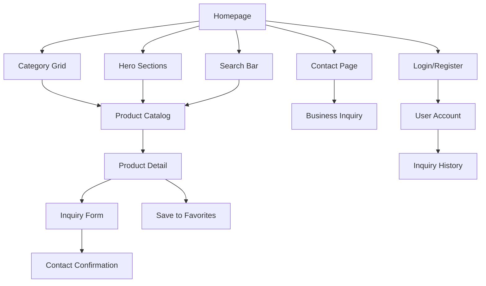

# Wakse-Inspired Product Showcase Site - Product Requirements Document

## 1. Product Overview

A high-gloss, product-focused informational website inspired by wakse.com featuring a modern dark theme with vibrant neon accents and plenty of negative space. The site delivers a playful yet polished product showcase experience for hair removal and beauty products.

The platform targets beauty enthusiasts seeking information about premium at-home waxing solutions, emphasizing product education and inquiry generation while maintaining a luxurious brand aesthetic that stands out in the competitive beauty market.

## 2. Core Features

### 2.1 User Roles

| Role | Registration Method | Core Permissions |
|------|---------------------|------------------|
| Visitor | No registration required | Browse products, view details, submit inquiries |
| Registered User | Email registration | Save favorites, inquiry history, newsletter subscription |
| Business User | Contact form application | Access to wholesale information, bulk inquiry forms |

### 2.2 Feature Module

Our wakse-inspired e-commerce site consists of the following main pages:

1. **Home page**: announcement bar with promotional messages, sticky header with search, category grid, multiple hero sections, promotional panels, social proof carousel
2. **Product catalog page**: filterable product grid, variant displays, sorting options, pagination
3. **Product detail page**: product gallery, variant information, inquiry form, reviews, related products
4. **Contact page**: inquiry forms, business information, location details, contact methods
5. **About page**: company story, team information, brand values, manufacturing process
6. **User account page**: inquiry history, profile management, saved products, newsletter preferences
7. **Login/Register pages**: authentication forms for account management

### 2.3 Page Details

| Page Name | Module Name | Feature description |
|-----------|-------------|---------------------|
| Home page | Announcement Bar | Display promotional messages and special offers, contrasting bright colors |
| Home page | Sticky Header | Include hamburger menu, logo, centered search field, account/inquiry icons on dark background |
| Home page | Category Grid | Two-row grid of clickable tiles with line icons for Hard Wax Beans, IPL Laser, Strips, etc. |
| Home page | Hero Sections | Full-width banners with product imagery, bold headlines, "Learn More" CTA buttons |
| Home page | Promotional Bars | Narrow strips with bright neon colors highlighting key product benefits |
| Home page | Tagline Bars | Playful brand messaging strips ("made by two hairy guys") between sections |
| Home page | Product Showcase | Horizontal display tabs with icons, product names, and feature highlights |
| Home page | Promotional Panels | Multi-column layouts with color-blocked backgrounds, product photos, inquiry CTAs |
| Home page | Value Proposition | Split-section highlighting product benefits and company values with large typography |
| Home page | Social Proof Carousel | Auto-rotating user-generated content with brand hashtags and customer testimonials |
| Home page | Footer Grid | Organized sections for contact info, legal info, newsletter signup, social media |
| Product Catalog | Filter Sidebar | Category filters, product type, application method, skin type compatibility |
| Product Catalog | Product Grid | Responsive grid with hover effects, quick view, "Get Info" buttons |
| Product Detail | Image Gallery | High-resolution product photos with zoom, multiple angles, lifestyle shots |
| Product Detail | Product Information | Detailed specifications, ingredients, usage instructions, benefits |
| Product Detail | Inquiry Form | Contact form for product questions, sample requests, bulk inquiries |
| Contact Page | Contact Forms | General inquiry, product questions, business partnership, support requests |
| Contact Page | Business Information | Company address, phone numbers, email contacts, business hours |
| About Page | Company Story | Brand history, mission statement, founder information, manufacturing process |
| User Account | Inquiry History | Past inquiries, responses, saved products, communication timeline |
| Login/Register | Authentication | Email/password forms, social login, password reset, account verification |

## 3. Core Process

**Visitor Flow:**
Users can browse the site freely, starting from the homepage with its eye-catching hero sections and category grid. They can search for products, view detailed product pages with comprehensive information, and submit inquiries for products of interest. Contact forms are available throughout the site for immediate assistance.

**Registered User Flow:**
Authenticated users enjoy the same browsing experience with additional features like saving favorite products, viewing inquiry history, and receiving personalized product recommendations. They can manage their account settings, track communication history, and subscribe to newsletters.

**Business User Flow:**
Business customers can access wholesale information and submit bulk inquiry forms through a dedicated section. They can request product catalogs, pricing information, and schedule consultations with the sales team.

## 4. User Interface Design

### 4.1 Design Style

- **Primary Colors**: Deep black (#000000) and very dark grey (#1a1a1a) for backgrounds
- **Accent Colors**: Bright neon pink (#ff0080), electric blue (#00ffff), lime green (#00ff00), vibrant yellow (#ffff00), soft pastels for variety
- **Button Style**: Rounded corners (8-12px radius), strong neon color fills, generous padding (12px vertical, 24px horizontal)
- **Typography**: Bold uppercase sans-serif for headings (Inter, Helvetica), lighter weights for body text
- **Layout Style**: Card-based design with generous negative space, top navigation, grid-based sections
- **Icons**: Minimalistic outlined style, consistent stroke width, simple geometric shapes
- **Effects**: Subtle gradients and glowing effects for CTAs, smooth hover transitions

### 4.2 Page Design Overview

| Page Name | Module Name | UI Elements |
|-----------|-------------|-------------|
| Home page | Announcement Bar | Thin strip spanning full width, bright neon background (#ff0080), white text, countdown timer with bold numbers |
| Home page | Sticky Header | Dark background (#1a1a1a), white logo and icons, centered search with rounded input field, hamburger menu |
| Home page | Category Grid | 2x5 grid layout, subtle border outlines, hover scale effect (1.05x), minimalist line icons, uppercase labels |
| Home page | Hero Sections | Full-width images with gradient overlays, bold uppercase headlines (48px+), prominent CTA buttons with glow effects |
| Home page | Promotional Panels | Color-blocked backgrounds with neon accents, high-contrast product photos, catchy headlines, rounded CTA buttons |
| Home page | Social Carousel | Horizontal scrolling tiles, user photos with overlay hashtags, auto-rotation with pause on hover |
| Home page | Footer | Dark background (#000000), organized grid layout, neon accent links, newsletter input with rounded styling |

### 4.3 Responsiveness

The site follows a desktop-first approach with mobile-adaptive design. Category tiles stack vertically on mobile, hero text sizes adjust proportionally, and touch interactions are optimized with larger tap targets (minimum 44px). Navigation collapses to hamburger menu, and carousels become swipeable on touch devices.
