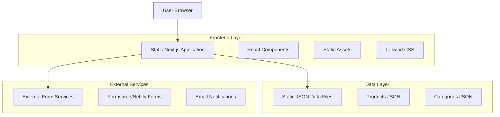
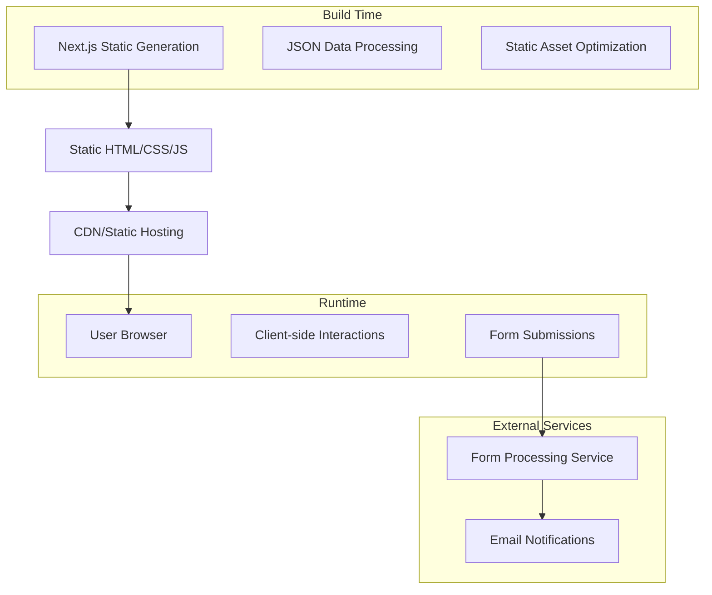
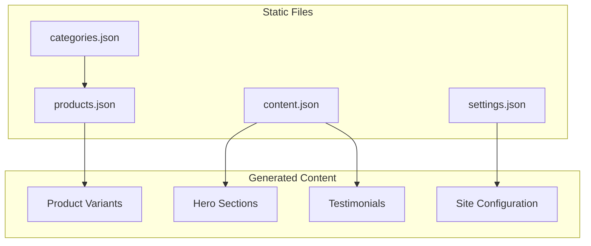

# Wakse-Inspired Product Showcase Site - Technical Architecture Document

## 1. Architecture Design



## 2. Technology Description

* **Frontend**: Next.js\@14 + React\@18 + TypeScript + Tailwind CSS\@3 + Framer Motion

* **Data Storage**: Static JSON files for products, categories, and content

* **Forms**: Formspree or Netlify Forms for contact and inquiry submissions

* **Email**: Form service handles email notifications automatically

* **Deployment**: Vercel, Netlify, or GitHub Pages for static hosting

## 3. Route Definitions

| Route             | Purpose                                                             |
| ----------------- | ------------------------------------------------------------------- |
| /                 | Homepage with hero sections, category grid, and promotional content |
| /products         | Product catalog page with filters and search functionality          |
| /products/\[slug] | Individual product detail page with information and inquiry forms   |
| /contact          | Contact page with inquiry forms and business information            |
| /about            | Brand story, company information, and team details                  |
| /account          | User dashboard for inquiry history and profile management           |
| /account/inquiries| Inquiry tracking and communication history                          |
| /account/favorites| Saved products and favorites                                        |
| /login            | User authentication and registration                                |
| /register         | New user account creation                                           |
| /wholesale        | Wholesale information and bulk inquiry forms                        |
| /blog             | Educational content and product usage guides                        |

## 4. Static Data Structure

### 4.1 JSON Data Files

**Products Data (data/products.json)**

```json
{
  "products": [
    {
      "id": "product-1",
      "name": "Premium Hard Wax Beans",
      "slug": "premium-hard-wax-beans",
      "description": "Professional-grade hard wax beans for salon-quality results at home",
      "ingredients": "Natural rosin, beeswax, coconut oil",
      "benefits": ["Gentle on sensitive skin", "Long-lasting results", "Easy to use"],
      "images": ["/images/products/wax-beans-1.jpg", "/images/products/wax-beans-2.jpg"],
      "category": "hard-wax-beans",
      "variants": [
        {"name": "Chocolate", "color": "#8B4513"},
        {"name": "Honey", "color": "#FFD700"}
      ]
    }
  ]
}
```

**Categories Data (data/categories.json)**

```json
{
  "categories": [
    {
      "id": "hard-wax-beans",
      "name": "Hard Wax Beans",
      "slug": "hard-wax-beans",
      "description": "Premium hard wax beans for professional results",
      "icon": "wax-bean",
      "sortOrder": 1
    }
  ]
}
```

**Contact Form Integration**

Forms submit directly to external services:
- Formspree: `https://formspree.io/f/{form-id}`
- Netlify Forms: Built-in form handling with `netlify` attribute
- No server-side processing required

## 5. Static Site Architecture



## 6. Static Data Structure

### 6.1 File Organization

```
data/
├── products.json          # All product information
├── categories.json        # Product categories
├── content.json          # Static content (hero sections, testimonials)
└── settings.json         # Site configuration

public/
├── images/
│   ├── products/         # Product images
│   ├── heroes/           # Hero section backgrounds
│   └── icons/            # Category and UI icons
└── favicon.ico
```

### 6.2 Data Relationships



### 6.3 Sample Data Structure

**Complete Products Data Example**

```json
{
  "products": [
    {
      "id": "hard-wax-chocolate",
      "name": "Chocolate Hard Wax Beans",
      "slug": "chocolate-hard-wax-beans",
      "description": "Premium chocolate-scented hard wax beans for professional at-home hair removal",
      "ingredients": "Natural rosin, beeswax, coconut oil, cocoa extract",
      "usageInstructions": "Heat to 65°C, apply against hair growth, remove with quick motion",
      "benefits": [
        "Gentle on sensitive skin",
        "Long-lasting smooth results",
        "Pleasant chocolate scent",
        "Professional salon quality"
      ],
      "images": [
        "/images/products/chocolate-wax-main.jpg",
        "/images/products/chocolate-wax-lifestyle.jpg",
        "/images/products/chocolate-wax-ingredients.jpg"
      ],
      "category": "hard-wax-beans",
      "featured": true,
      "variants": [
        {
          "name": "Small (100g)",
          "sku": "CHW-100",
          "attributes": {"weight": "100g", "color": "#8B4513"}
        },
        {
          "name": "Large (500g)",
          "sku": "CHW-500",
          "attributes": {"weight": "500g", "color": "#8B4513"}
        }
      ]
    }
  ]
}
```

**Content Management Example**

```json
{
  "heroSections": [
    {
      "id": "main-hero",
      "title": "Game-Changing Hair Removal Products",
      "subtitle": "At-home waxing has never been more affordable!",
      "backgroundImage": "/images/heroes/main-hero-bg.jpg",
      "ctaText": "SHOP NOW",
      "ctaLink": "/products"
    }
  ],
  "taglines": [
    "🐒 made by two hairy guys. 🦍",
    "Save time and money taking care of the hair at home!"
  ],
  "testimonials": [
    {
      "text": "Best wax I've ever used!",
      "author": "@beautyqueen",
      "image": "/images/testimonials/user1.jpg"
    }
  ]
}
```

**Site Configuration**

```json
{
  "site": {
    "name": "Wakse",
    "tagline": "Premium Hair Removal Products",
    "contactEmail": "hello@wakse.com",
    "socialMedia": {
      "instagram": "@wakse",
      "tiktok": "@wakse"
    }
  },
  "forms": {
    "contactFormEndpoint": "https://formspree.io/f/your-form-id",
    "newsletterEndpoint": "https://formspree.io/f/your-newsletter-id"
  },
  "features": {
    "freeShippingThreshold": 25,
    "currency": "USD"
  }
}
```

